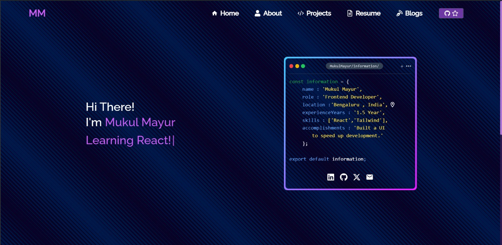

 
    </img>

<h1 align="center"> Software Developer Portfolio 💗</h1> 
<h3 align="center"> A clean, beautiful, responsive, and 100% customizable portfolio   template for Software Developers! </h3>

 
    

⭐ **Star us on GitHub — it helps!** 

## Features

**📖 Multi-Page Layout**

**🎨 Styled with React-Tailwind and Css with easy to customize colors**

# Sections 📚

✔️ Summary and Home\
✔️ Skills \
✔️ About me\
✔️ Resume\
✔️ Blogs 🏆\
✔️ Source Code\
✔️ Contact me

To view a live example, **[click here](https://mukulmayur.github.io/Portfolio/)**

# Technologies used 🛠️

- [React](https://reactjs.org/)
- [Tailwind css](https://tailwindcss.com/docs/guides/vite)
- [Vite](https://tailwindcss.com/docs/guides/vite)
- [baseui](https://github.com/uber/baseweb)
- [react-reveal](https://www.react-reveal.com/)
- [styled-components](https://styled-components.com/)

## Authors

👤 **Mukul Mayur**

- GitHub: [@MukulMayur](https://github.com/MukulMayur)
- X.com: [@mukulmayur](https://x.com/mayur_muku91178)
- LinkedIn: [Mukul Mayur](https://in.linkedin.com/in/mukul-mayur-98497821b)

# References 👏🏻

- Some Design and Implementation Ideas are taken from [soumyajit4419
  ](https://github.com/soumyajit4419/Portfolio).
